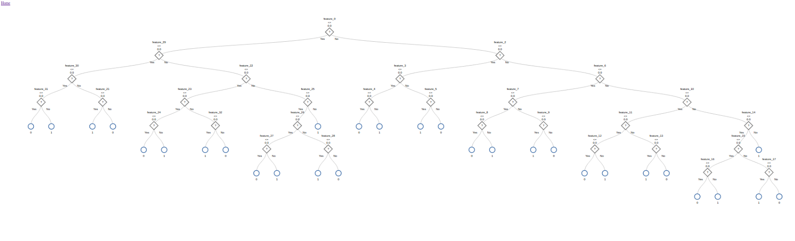

EurekaTrees
==============

This program was made to visualize MLLib Random Forests. Running this program with a supplied trees file generates 
visual version of the trees. You can get this from printing out the debug string of the generated model. In python that is:
`model.toDebugString()`

**Install:** 
`pip install eurekatrees`

**Run:** 
`eurekatrees --trees ./sample_files/trees.txt`

**Output:** 
The output path for generated files can be specified with the output_path switch which defaults to the current working dir.
`eurekatrees --trees ./smaple_files/trees.txt --output_path .`

**If you have a csv with the names of your features you can run that command with the columns switch.** 
`eurekatrees --trees ./sample_files/trees.txt --columns ./sample_files/columns.csv`

The output are a bunch of HTML files. It auto opens home.html in your default browser, but you can also open up the file home.html allowing you to easily navigate to each of your trees.

**Important Note:** 
The last change that was made splays out branches further which means more scrolling for right now, but I am looking into d3 canvas zooming to fit it to the page then allow the user to move around inside of the canvas. If anybody have any experience with doing this feel free to contribute or pass along any tips. Thanks!

**Example Tree:**

**Credit**
D3.js tree example from http://bl.ocks.org/d3noob/8326869 was a great help.
